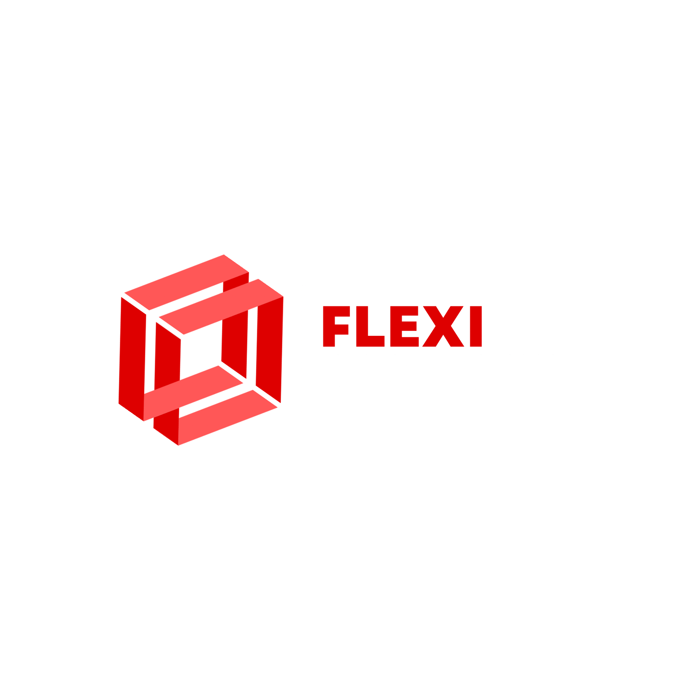

[](https://flexibuckets.com)
[](https://opensource.org/licenses/MIT)
[](https://hub.docker.com/r/flexibuckets/flexibuckets)
[](https://bun.sh)
[](https://nextjs.org/)
[](https://github.com/flexibuckets/flexibuckets/actions/workflows/build-and-push.yml)


FlexiBuckets is an open-source, self-hosted solution for managing multiple S3-compatible storage buckets in one unified interface. Perfect for developers and teams who work with various S3-compatible storage providers.

## ✨ Features

- 🔄 **Multi-Bucket Support**: Connect and manage multiple S3-compatible storage buckets
- 📁 **Unified Interface**: Browse, upload, and manage files across all your buckets
- 🔐 **Secure**: Self-hosted and runs entirely in your infrastructure
- 📤 **Easy File Sharing**: Generate temporary links for file sharing
- 📱 **Responsive Design**: Works seamlessly on desktop and mobile
- 🚀 **Fast Performance**: Built with Bun and Next.js for optimal speed

## 🎯 Supported Storage Providers

- AWS S3
- DigitalOcean Spaces
- MinIO
- Backblaze B2
- Wasabi
- Any S3-compatible storage

## 🚀 Quick Start

The easiest way to get started is using Docker:

To use the improved installation:

Basic installation:

```bash
curl -fsSL https://cdn.flexibuckets.com/install.sh | sudo bash

```


The installation script will:
1. Install necessary dependencies
2. Set up the database
3. Configure environment variables
4. Start FlexiBuckets


Visit `http://your-server-ip:3000` to access your FlexiBuckets instance.

## 🛠 Manual Installation

If you prefer to set up manually:

1. Clone the repository:
```bash
git clone https://github.com/flexibuckets/flexibuckets.git
cd flexibuckets
```

2. Create and configure .env file:
```bash
cp .env.example .env
# Edit .env with your settings
```

3. Start using Docker Compose:
```bash
docker compose up -d
```

## 🔒 Environment Variables

| Variable | Description | Default |
|----------|-------------|---------|
| `DATABASE_URL` | PostgreSQL connection URL | `postgresql://postgres:postgres@db:5432/flexibuckets` |
| `NEXTAUTH_URL` | Your site URL | `http://localhost:3000` |
| `NEXTAUTH_SECRET` | Random string for auth | Generated during install |

## 📦 Building from Source

```bash
# Install dependencies
bun install

# Generate Prisma client
bunx prisma generate

# Build the application
bun run build

# Start the server
bun run start
```

## 🌟 Contributing

We love contributions! Please see our [Contributing Guide](CONTRIBUTING.md) for details.

1. Fork the repository
2. Create a feature branch
3. Commit your changes
4. Push to the branch
5. Open a Pull Request

## 📄 License

FlexiBuckets is MIT licensed, as found in the [LICENSE](LICENSE) file.

## 🤝 Support

- 📝 [Documentation](https://docs.flexibuckets.com)
- 🐛 [Issue Tracker](https://github.com/flexibuckets/flexibuckets/issues)


## ⭐️ Show Your Support

Give a ⭐️ if this project helped you!


⚠️ Security Note: The auto-update feature requires mounting the Docker socket and 
granting certain privileges to the container. This is necessary for the application 
to manage its own updates, but it does mean the container has elevated permissions 
on your system. If this is a concern, you can disable auto-updates and manage 
updates manually.